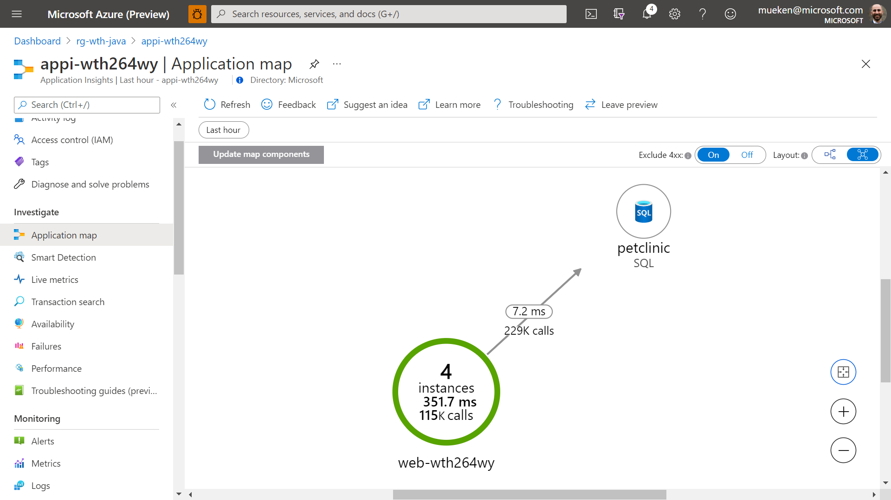

# Challenge 4: Do you know what’s going on in your application?

[< Previous Challenge](./solution-03.md) - **[Home](./README.md)** - [Next Challenge >](./solution-05.md)

## Notes & Guidance

- First, create an Application Insights instance, there's again many different ways to achieve that, but you can use the included [appinsights.bicep](./Solutions/appinsights.bicep) file for that.

    ```shell
    APPI_CONN_STR=`az deployment group create -g $RG -f Solutions/appinsights.bicep --query properties.outputs.appInsights.value -o tsv`
    ```

- This template puts the Application Insights connection string into the Key Vault and displays the reference to be used by the web app. If you don't use the template, you'll have to do that yourself.
- Download the Application Insights agent jar, at the time of this writing the latest version is 3.0.2

    ```shell
    APPI_VERSION=3.0.2
    wget https://github.com/microsoft/ApplicationInsights-Java/releases/download/$APPI_VERSION/applicationinsights-agent-$APPI_VERSION.jar
    ```

- Now zip it together with app.jar and deploy that combination (from the `spring-petclinic` directory)

    ```shell
    zip -j deployment.zip applicationinsights-agent-$APPI_VERSION.jar target/app.jar
    az webapp deployment source config-zip -g $RG -n $WEBAPP --src deployment.zip
    ```

- Finally, configure the application settings

    ```shell
    AGENT_CONFIG="-javaagent:/home/site/wwwroot/applicationinsights-agent-$APPI_VERSION.jar"
    az webapp config appsettings set -g $RG -n $WEBAPP --settings \
        APPLICATIONINSIGHTS_CONNECTION_STRING=$APPI_CONN_STR \
        JAVA_OPTS="-Dspring.profiles.active=mysql $AGENT_CONFIG"    
    ```

- Although the idea is not to change any of the files, including the pom file, the deployment (including the agent jar) can also be done through `mvn`. See here [an example and instructions](https://github.com/meken/app-services-app-insights-java).
- Metrics could be explored through Applicaton Insights Overview or Live Metrics blades. Application Insights agent has support for [SLF4J/Logback](https://logback.qos.ch) and hence can capture all logs without any modification. In order to explore the logs you'd need to look at the `traces` table through Application Insights Logs blade. Note that if `Find owners` is called from the web app without specifying the owner name, an INFO log statement is emitted by the application with the message `Request to list all owners registered`.
- Once there's sufficient data collected (will take a few minutes and some exploration of the application), you should see something like the picture below (the screenshot shows 4 instances because it was created after a load test, but it should be 1 for the students at this stage).
    
